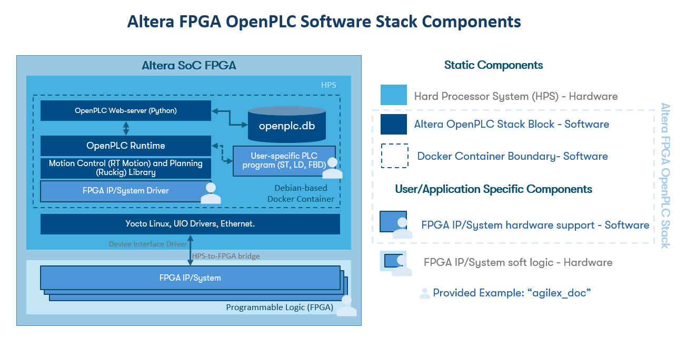
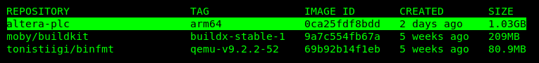

# Altera® FPGA OpenPLC

## Overview

Industrial control systems often make use Programmable Logic Controllers (PLCs) to control
electrical equipment by emulating relay logic. OpenPLC is a fully open source implementation
of a standardized PLC platform, supporting standard PLC programming languages such as
Structured Text (ST).

This repository provides files to build a Docker image for deploying an OpenPLC Runtime on Altera®
SOC FPGA Devices. You must ensure the Linux system on the SoC (Hard Processor System, HPS) has
virtualization enabled and Docker installed. Refer to the Yocto/Kas config in this
[link](https://github.com/altera-fpga/agilex-ed-drive-on-chip/blob/main/sw/kas_dual_axis.yml)
for building a compatible HPS image with the necessary Docker container runtime.

The software stack is provided with an example on how to interface with a system in the FPGA soft logic
known as "Drive-On-Chip for Agilex™ Devices" (see the directory `hardware_support`). More information regarding this
reference design can be found in [Drive-On-Chip with PLC Design Example for Agilex™ 5 Devices](https://altera-fpga.github.io/rel-24.3/embedded-designs/agilex-5/e-series/modular/drive-on-chip/doc-plc/)

You can use this software stack with any IP and/or system programmed in the FPGA fabric
of any Altera® SoC FPGA device that supports docker container deployments. You must assure the
compatibility of your hardware to be controlled by the OpenPLC Runtime by writing a
bonding software layer and webserver patches similar than the ones provided in `hardware_support`
directory: `agilex_doc.cpp` and `agilex_doc.patch`

The [Drive-On-Chip with PLC Design Example for Agilex™ 5 Devices](https://altera-fpga.github.io/rel-24.3/embedded-designs/agilex-5/e-series/modular/drive-on-chip/doc-plc/) provides an example (`programs/agilex_doc.st`) of how to write a PLC Structured Text (ST)
application that makes use of motor controllers implemented in the FPGA fabric. You can
use this as a reference to write your own PLC compliant programs in any of the IEC 61131-3
languages (ST, LD, FBD, SFC) for your system/IP and deploy it in the OpenPLC Runtime
compiled and executed inside the Docker Container.

<br>

<center>



</center>

## Build a Docker Image

You can build the Docker image by either cross-compiling on the host machine or directly
creating the image on the target device.

### Cross-compile the Docker image in a host machine

Follow the next set of instructions to cross-compile the Altera® FPGA OpenPLC stack to target an
ARM64-based HPS (found in Agilex class devices).

* Build host minimal requirements:
  * 8 GB of RAM.
  * Linux OS installed.
  * ~5GB storage for Docker Container Cross-Compilation.
  * Docker Engine Version 26.0 or later with Buildx support for ARM64. See:
    * [Install Docker Engine](https://docs.docker.com/engine/install/)
    * [Docker Build: Multi-Platform Builds](https://docs.docker.com/build/building/multi-platform/)

* Ensure Docker is installed, refer to: [Install Docker Engine](https://docs.docker.com/engine/install/)

* Create a workspace and clone this repository:

```bash
    mkdir workspace
    cd workspace
    git clone https://github.com/altera-fpga/altera-openplc altera-openplc
    cd altera-openplc
```

* If necessary verify your Buildx installation:

```bash
    docker buildx version
```

* Create a new builder instance (in this example named `mybuilder`) and set it as
  default. Use the `inspect` command to initialize the builder and show its details.

```bash
    docker buildx create --name mybuilder --use
    docker buildx inspect --bootstrap
```

**_NOTE:_** If the cross-compilation fails showing "segmentation faults" or similar, try installing QEMU version 9.2.2-52 with the commands:

```bash
    docker run --privileged --rm tonistiigi/binfmt:qemu-v9.2.2-52 --uninstall qemu-*
    docker run --privileged --rm tonistiigi/binfmt:qemu-v9.2.2-52 --install all
```

* Check the `Dockerfile` and build the image for the target platform (in this case ARM64)
  architecture:

```bash
    docker buildx build --load --no-cache --progress=plain --platform linux/arm64 -t altera-plc:arm64 .
```

* Verify the image is created and save the docker image in a `.tar.gz` for later deployment

```bash
    docker image ls
    docker save altera-plc:arm64 | gzip > altera-plc.tar.gz
```

<center>



</center>

**_NOTE:_** To run the container for "Drive-On-Chip with PLC Design Example for Agilex™ 5 Devices" follow the instructions described in: https://altera-fpga.github.io/rel-24.3/embedded-designs/agilex-5/e-series/modular/drive-on-chip/doc-plc/

* After transferring the `altera-plc.tar.gz` to the target device (Altera® SoC FPGA).
  The usual commands to load and run a docker container on a target device are:

```bash
    user@target:~# docker load < <image-name>.tar.gz
    user@target:~# docker image ls
    user@target:~# docker run -it --rm --device /dev/<dev> --network host <image-name>:<image-tag>

```

### Compile the Docker image on the target device (Altera® SoC FPGA)

* Once your target device booted Linux, create a workspace and clone this repository:

```bash
    git clone https://github.com/altera-fpga/altera-openplc altera-openplc
    cd altera-openplc
```

* Build the image using the provided Dockerfile

```bash
    docker build -t <image-name>:<image-tag> .
```

* Run the image on the target device

```bash
    docker run -it --rm --device /dev/<dev> --network host <image-name>:<image-tag>
```
